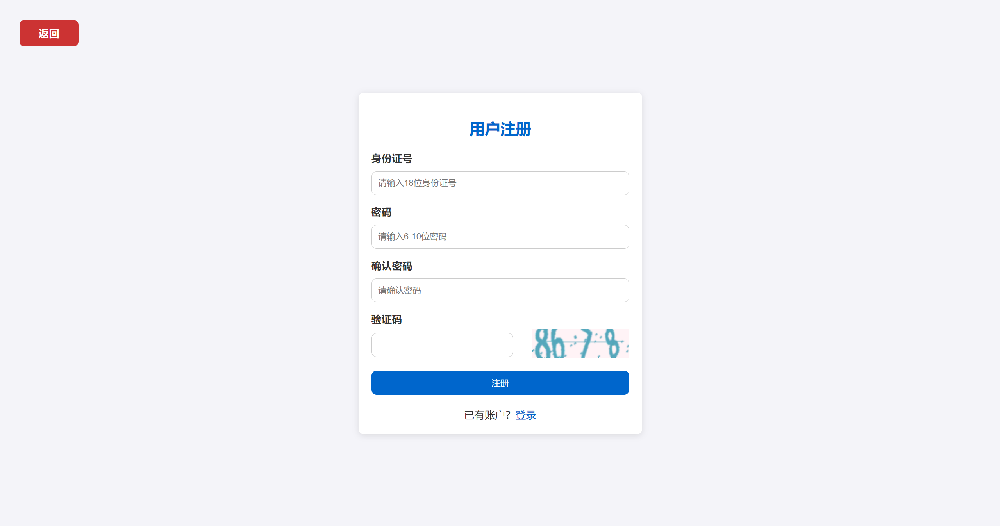
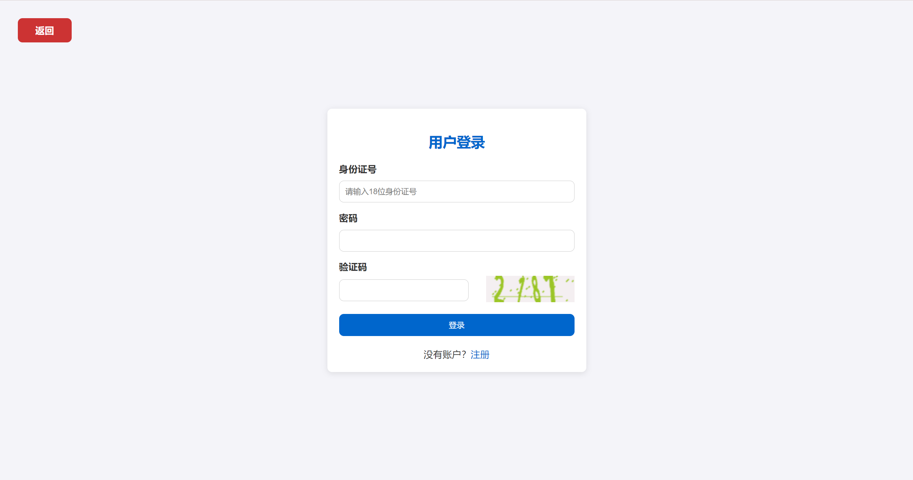
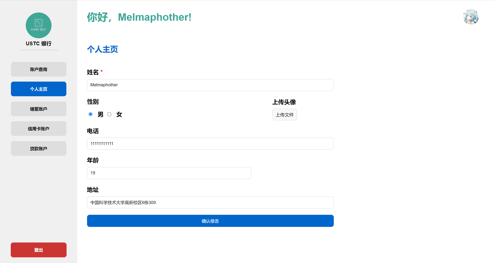
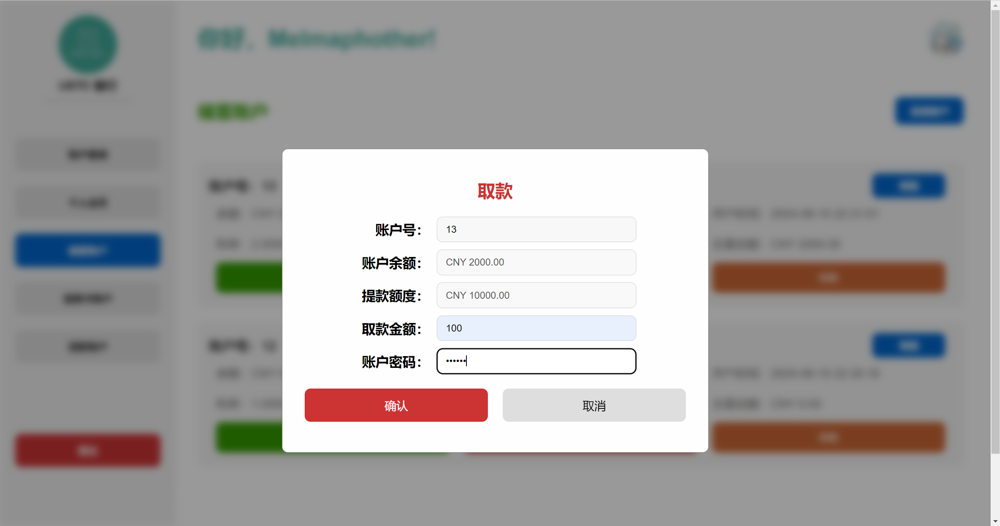
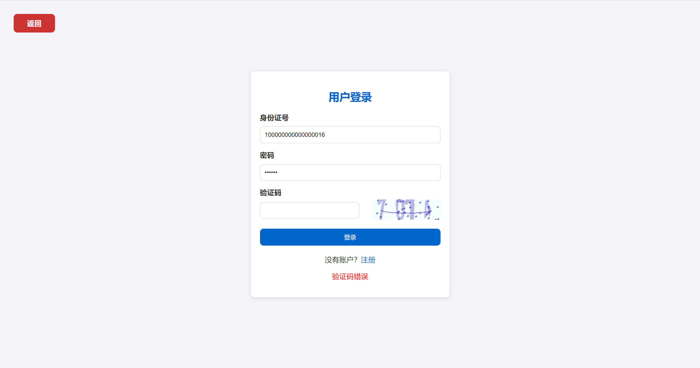

# 2024-USTC-Database-Lab2


## 基本信息

1. 本项目为 2024 年 USTC 数据库设计与应用（陈欢欢，周熙人）实验二，选择以银行管理系统为主题，实现一个 USTC 银行在线管理平台。

2. 本项目基于 Django 框架，以 MySQL 为后端，以 HTML、CSS、JavaScript 为前端。

3. 本文档主要包括项目的快速开始、项目展示、项目细节，查看更多说明请查看 docs 文件夹。
   | 文件 | 链接 |
   | --- | --- |
   | 需求分析 | [Demand Analysis](docs/Demand%20Analysis.md) |
   | 设计分析 | [Design Analysis](docs/Design%20Analysis.md) |
   | 项目日志 | [Project Log](docs/Project%20Log.md) |
   | 实验手册 | [Experiment Manual](docs/Exp%20Manual.pdf) |
   | 我的 Django 笔记 | [Django Note](docs/Django%20Notes/Django%20Note.md) |

## 快速开始

1. 本项目使用的软件有：

   | 软件             | 版本   | 下载方式                                                                 |
   | ---------------- | ------ | ------------------------------------------------------------------------ |
   | MySQL            | 8.0    | [MySQL](https://www.mysql.com/cn/downloads/)                             |
   | Python           | 3.11   | [Anaconda](https://www.anaconda.com/download)                            |
   | Django           | 5.0    | [Django](https://www.djangoproject.com/download/)                        |
   | DataGrip         | 2024.1 | [DataGrip](https://www.jetbrains.com/datagrip/)                          |
   | PyCharm          | 2024.1 | [Pycharm](https://www.jetbrains.com/pycharm/)                            |
   | PDManer 元数建模 | 4.9    | [pdmaner](https://gitee.com/robergroup/pdmaner)                          |
   | draw.io          | 24.5   | [draw.io](https://github.com/jgraph/drawio-desktop/releases/tag/v24.5.1) |

2. 简单配置流程
   - clone 本项目：
     ```bash
      $ git clone https://github.com/Melmaphother/2024-USTC-Database-Lab2.git
     ```
   - 安装 MySQL，创建数据库 `bank_manage_system`：
     ```bash
     $ mysql -u username -p password
     $ create database db_name default charset=UTF8MB4
     ```
   - 进入目录 `src/BankManageSystem/BankManageSystem/settings.py`，修改数据库配置：
     ```python
     DATABASES = {
         'default': {
             'ENGINE': 'django.db.backends.mysql',
             'NAME': 'bank_manage_system',
             'USER': 'your username',
             'PASSWORD': 'your password',
             'HOST': 'localhost',
             'PORT': '3306',
           }
       }
     ```
   - 安装 Anaconda，搭建 Python 环境：
     ```bash
     $ conda create -n django python=3.11
     $ conda activate django
     ```
   - 安装必要的包：
     ```bash
     $ pip install -r requirements.txt
     ```
   - 进入目录 `src/BankManageSystem`，创建数据表：

     ```bash
     $ python manage.py migrate
     ```

   - 在数据库 IDE（DataGrip、MySQL Workbench）中，运行 `src/sql_src/init_database.sql`：

     这一步是为了避免外键依赖导致业务操作失败。

   - 启动本地服务器：

     ```bash
     $ python manage.py runserver [localhost:8000]
     ```

   - 在浏览器中输入 `localhost:8000`，即可查看项目：
     为了保证使用体验，建议使用 **Chrome 或 Edge 浏览器**，将窗口**缩放为 125%** 体验更佳。

## 项目展示

1. 欢迎界面

   

2. 注册界面

   

3. 注册后填写个人信息

   

4. 登录界面

   

5. 主页

   

6. 个人主页

   

7. 添加账户

   不跳转 url，通过背景模糊 + 弹窗的形式，动态展示添加账户页面，符合用户直觉。

   

8. 账户详情

   

9. 存款

   

10. 取款

    

11. 转账

    

12. 查看明细

    

13. 表单填写错误处理
    刷新验证码，保存未出错的表单信息，避免重复填写，提示错误信息。

    

14. 账户操作提示信息
    以浏览器自带 alert 提示操作成功或失败的信息。

    

## 项目细节

### 文件结构

```bash
2024-USTC-Database-Lab2
│  LICENSE
│  README.md
│  requirements.txt
│
├─docs/assets  README.md 中的图片
│
├─design
│  │
│  ├─backend  后端设计，包括数据库建模、API 设计、ER 图
│  │
│  └─frontend  前端设计，包括页面设计
│
├─docs  项目文档，包括需求分析、设计分析、项目日志、实验手册
│  │
│  └─Django Notes  Django 笔记
│
└─src
    ├─BankManageSystem  Django 项目
    │  │  manage.py  Django 项目启动文件
    │  │
    │  ├─BankManageSystem  Django 项目配置文件，包括路由、数据库配置
    │  │
    │  ├─bank_service  银行服务，包括主页、注册、登录、账户的视图函数
    │  │  │
    │  │  └─account_utils  专门用于处理各种账户交易的视图函数
    │  │
    │  ├─statics  静态文件
    │  │  ├─css  欢迎界面、注册、登录的样式
    │  │  │  │
    │  │  │  └─dashboard  登入后具体各部分的主页样式
    │  │  │
    │  │  ├─image
    │  │  │      logo.png  项目的 logo
    │  │  │
    │  │  └─js  主页 js 文件
    │  │      │
    │  │      └─dashboard  登入后具体各部分的主页 js 文件
    │  │
    │  └─templates  html 文件，包括欢迎界面、注册、登录、主页
    │      │
    │      └─dashboard  登入后具体各部分的主页
    │
    └─sql_src  数据库存储过程、函数、触发器、初始化数据库
```

### Tips

如果你想上手或改造本项目，可能需要学习的知识有：

1. 熟练使用 ChatGPT
2. 熟练使用 Python
3. 了解 Django MTV（model、template、view）模型的原理
4. 了解 Django orm（Object-Relational Mapper） 语法
5. HTML、CSS 基础
6. JavaScript 懂一点点

### 教程

学习 Django 的教程：

- [Django 官方英文文档]()：首选，不会直接查，不需要学完

- [Django 官方中文文档]()：某些难以理解的也可以结合中文看
- [Django 菜鸟教程]()：当故事看，前几章的介绍质量还是挺不错的

学习 HTML、CSS 教程：

- [MDN Web Docs](https://developer.mozilla.org/en-US/docs/Learn/Getting_started_with_the_web)：由 FireFox 团队编写，非常适合新手入门，很可惜我目前不用 FireFox

- [MDN Web Docs 中文版](https://developer.mozilla.org/zh-CN/docs/Learn/Getting_started_with_the_web)
