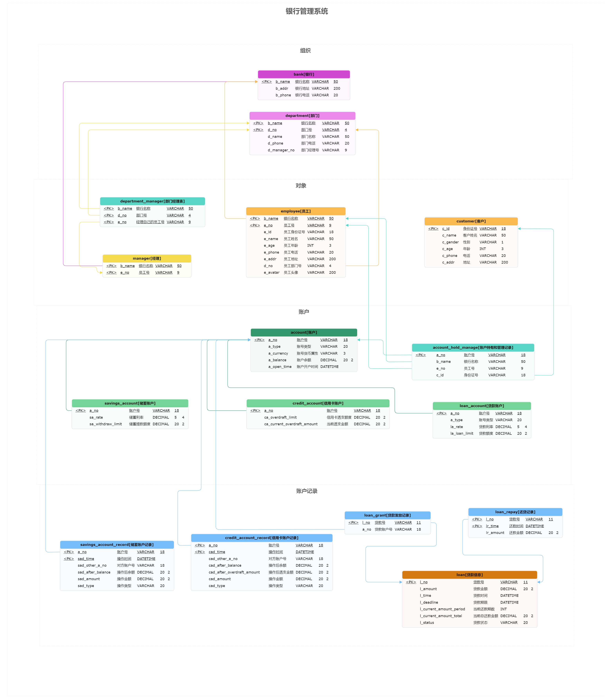

# 银行管理系统需求分析

本项目基于 MySQL、Python、Django 框架，实现一个 USTC 银行管理系统。本文档主要包括项目的需求分析、功能设计和多模态信息需求的总结。本项目使用的软件有：

- MySQL 8.0
- Python 3.11
- Django 5.0
- Datagrip 2024.1
- PyCharm 2024.1
- PDManer 元数建模 4.9

本项目的设计时间为 2024 年 5 月 17 日至 2024 年 6 月 1 日。

## 命名规范

> 考虑到 MySQL 大小写不敏感，并且 Datagrip 会自动将表名转为小写，因此以下命名规范均为全小写

1. 数据库表中的表名均为全小写，如 `bank` 代表银行，多个单词之间使用下划线 `_` 分隔
2. 数据库属性名为表名各个单词首字母 + 下划线 + 属性名，如 `b_name` 代表银行名称

## 数据需求

1. 银行信息
   - 主属性：银行名称 `VARCHAR(50)`
   - 其他属性：
     - 银行地址 `VARCHAR(200)`：考虑到银行地址可能很长
     - 银行电话 `VARCHAR(20)`：考虑海外电话
2. 客户信息
   - 主属性：身份证号，全部为 18 位数字 `VARCHAR(18)`
   - 其他属性：
     - 姓名 `VARCHAR(50)`：考虑到外国人名可能很长
     - 性别 `VARCHAR(1)`：M 代表男性，F 代表女性，U 表示未知，这里不考虑无性别者
     - 年龄 `INT`
     - 电话 `VARCHAR(20)`，与银行电话保持一致
     - 地址 `VARCHAR(200)`，与银行地址保持一致
3. 账户信息
   - 主属性：账户号 `VARCHAR(18)`，两个字母加 16 个数字
   - 其他属性：
     - 账户类型 `VARCHAR(20)`：Savings, Credit, Loan, 分别代表储蓄、信用卡、贷款
     - 货币属性 `VARCHAR(3)`：USD, CHY, EUR, JPY, GBP，分别代表美元、人民币、欧元、日元、英镑，目前只考虑这五种货币
     - 账户余额 `DECIMAL(20, 2)`：保留两位小数
     - 开户时间 `DATETIME`：YYYY-MM-DD HH:MM:SS，精确到秒
   - 储蓄账户是账户的子类，继承账户的所有属性，还有：
     - 储蓄账户号 `VARCHAR(18)`：以 SA 开头，后面为 16 位数字（Savings Account）
     - 储蓄利率 `DECIMAL(5, 4)`：保留四位小数
     - 提款额度 `DECIMAL(20, 2)`：保留两位小数，与账户余额保持一致
   - 信用卡账户是账户的子类，继承账户的所有属性，还有：
     - 信用卡账户号 `VARCHAR(18)`：以 CA 开头，后面为 16 位数字（Credit Account）
     - 透支额度 `DECIMAL(20, 2)`：保留两位小数
     - 当前透支金额 `DECIMAL(20, 2)`：保留两位小数
   - 贷款账户是账户的子类，继承账户的所有属性，还有：
     - 贷款账户号 `VARCHAR(18)`：以 LA 开头，后面为 16 位数字（Loan Account）
     - 贷款利率 `DECIMAL(5, 4)`：保留四位小数
     - 贷款额度 `DECIMAL(20, 2)`：保留两位小数
4. 账户操作
   - 储蓄账户操作类型 `VARCHAR(20)`：deposit, withdraw, transfer_in, transfer_out, 表示存款、取款、转入、转出
   - 信用卡账户操作类型 `VARCHAR(20)`：deposit, withdraw, transfer_in, transfer_out, 表示存款、取款、转入、转出
   - 贷款账户操作类型：申请贷款、还款，用两个表保存，不需要设置操作类型
   - 注意：存款、取款的对方账户号直接设置为 NULL，转账的对方账户号必须存在
   - 注意：为了方便起见，认为信用卡账户的透支是一种 **状态，不属于一个具体行为，归类于取款或转出行为**，是否透支由其他字段判断（取款后透支金额大于 0 即可）
5. 贷款信息
   - 主属性：贷款号 `VARCHAR(11)`，以 L 开头，后面为 10 位数字（Loan）
   - 其他属性：
     - 贷款金额 `DECIMAL(20, 2)`：保留两位小数
     - 贷款时间 `DATETIME`：YYYY-MM-DD HH:MM:SS，精确到秒
     - 贷款期限 `DATETIME`：YYYY-MM-DD HH:MM:SS，精确到秒
     - 当前还款期数 `INT`
     - 当前总还款金额 `DECIMAL(20, 2)`：保留两位小数
     - 当前状态 `VARCHAR(20)`：ungranted, granted_unrepaid, repaid, canceled, 分别代表未发放、已发放未还款、已还款、已取消
6. 银行部门信息
   - 主属性：部门号 `VARCHAR(4)`：以 D 开头，后面为 3 位数字（Department）
   - 其他属性：
     - 部门名称 `VARCHAR(50)`
     - 部门电话 `VARCHAR(20)`
7. 银行员工信息
   - 主属性：员工号 `VARCHAR(9)`：以 E 开头，后面为 8 位数字（Employee）
   - 其他属性：
     - 员工身份证号 `VARCHAR(18)`：与客户身份证号保持一致
     - 员工姓名 `VARCHAR(50)`：与客户姓名保持一致
     - 员工性别 `VARCHAR(1)`：与客户性别保持一致
     - 员工年龄 `INT`：与客户年龄保持一致
     - 员工电话 `VARCHAR(20)`：与客户电话保持一致
     - 员工地址 `VARCHAR(200)`：与客户地址保持一致
     - 员工部门号 `VARCHAR(4)`：与部门号保持一致
     - 员工头像（只是数据库的一个索引） `VARCHAR(200)`：存储头像的路径
   - 银行经理是员工的子类，继承员工的所有属性，还有：
     - 经理号 `VARCHAR(9)`：以 M 开头，后面为 8 位数字（Manager）

## 数据库实体设计

1. 银行 `bank`, `b`
     是银行系统中的可标识对象，因此是实体，实体设计为：
       $(\underline{银行名称}, 银行地址, 银行电话)$
       $(\underline{b\_name}, b\_addr, b\_phone)$

2. 客户 `customer`, `c`
     是现实世界中的可标识对象，因此是实体，实体设计为：
       $(\underline{身份证号}, 姓名, 性别, 年龄, 电话, 地址)$
       $(\underline{c\_id}, c\_name, c\_gender, c\_age, c\_phone, c\_addr)$

3. 部门 `department`, `d`
     是银行系统中的可标识对象，由银行和部门号唯一标识，因此是实体，实体设计为：
     $(\underline{银行名称}, \underline{部门号}, 部门名称, 部门电话, 部门经理号)$
     $(\underline{b\_name}, \underline{d\_no}, d\_name, d\_phone, d\_manager\_no)$

4. 员工 `employee`, `e`
     是银行系统中的可标识对象，由银行和员工号唯一标识，因此是实体，实体设计为：
       $(\underline{银行名称}, \underline{员工号}, 员工身份证号, 员工姓名, 员工性别, 员工年龄, 员工电话, 员工地址, 员工部门号, 员工头像)$
       $(\underline{b\_name}, \underline{e\_no}, e\_id, e\_name, e\_gender, e\_age, e\_phone, e\_addr, e\_dno, e\_avatar)$

5. 经理 `manager`, `m`
     是员工的子类，实体设计与员工相同，部门经理号放在部门中

6. 部门经理表 `department_manager`, `dm`

     是银行系统中的可标识对象，用于银行名称、部门号、经理员工号唯一标定，因此是实体，实体设计为：

      $(\underline{银行名称}, \underline{部门号}, \underline{经理员工号})$

      $(\underline{b\_name}, \underline{d\_no}, \underline{e\_no})$

7. 账户 `account`, `a`
    是银行系统中的可标识对象，由账户号唯一标识，因此是实体，实体设计为：
    $(\underline{账户号}, 账户类型, 货币属性, 账户余额, 开户时间)$
    $(\underline{a\_no}, a\_type, a\_currency, a\_balance, a\_open\_time)$

8. 储蓄账户 `savings_account`, `sa`
    是账户的子类，实体设计与账户相同，但是需要添加利率、提款额度属性
    利率：$sa\_rate$，提款额度：$sa\_withdraw\_limit$

9. 信用卡账户 `credit_account`, `ca`
    是账户的子类，实体设计与账户相同，但是需要添加透支额度、当前透支金额属性
    透支额度：$ca\_overdraft\_limit$，当前透支金额：$ca\_current\_overdraft\_amount$

10. 贷款账户 `loan_account`, `la`
    是账户的子类，实体设计与账户相同，但是需要添加利率、贷款额度属性
    利率：$la\_rate$，贷款额度：$la\_loan\_limit$

11. 账户持有和管理记录 `account_hold_manage`, `ahm`
    是银行系统中的可标识对象，由账户号唯一标识，因此是实体，实体设计为：
    $(\underline{账户号}, 银行名称, 员工号, 身份证号)$
    $(\underline{a\_no}, b\_name, e\_no, c\_id)$

12. 储蓄账户记录 `savings_account_record`, `sar`
    是银行系统中的可标识对象，由账户号和操作时间唯一标识，因此是实体，实体设计为：
    $(\underline{账户号}, \underline{操作时间}, 对方账户号, 操作后余额, 操作金额, 操作类型)$
    $(\underline{a\_no}, \underline{sad\_time}, sad\_other\_a\_no, sad\_after\_balance, sad\_amount, sad\_type)$

13. 信用卡账户记录 `credit_account_record`, `car`
    是银行系统中的可标识对象，由账户号和操作时间唯一标识，因此是实体，实体设计为：
    $(\underline{账户号}, \underline{操作时间}, 对方账户号, 操作后余额, 操作后透支金额, 操作金额, 操作类型)$
    $(\underline{a\_no}, \underline{cad\_time}, cad\_other\_a\_no, cad\_after\_balance, cad\_after\_overdraft\_amount, cad\_amount, cad\_type)$

14. 贷款信息 `loan`, `l`
    是银行系统中的可标识对象，由银行发放，由贷款号唯一标识，因此是实体，实体设计为；
    $(\underline{贷款号}, 贷款金额, 贷款时间, 贷款期限, 当前还款期数, 当前总还款金额, 当前状态)$
    $(\underline{l\_no}, l\_amount, l\_time, l\_deadline, l\_current\_amount\_period, l\_current\_amount\_total, l\_status)$

15. 还贷记录 `loan_repay`, `lr`
    是银行系统中的可标识对象，由贷款账户号和还款时间唯一标识，因此是实体，实体设计为：
    $(\underline{贷款号}, \underline{还款时间}, 还款金额)$
    $(\underline{l\_no}, \underline{lr\_time}, lr\_amount)$

16. 贷款发放记录 `loan_grant`, `lg`
    是银行系统中的可标识对象，由贷款号唯一标识，因此是实体，实体设计为：
    $(\underline{贷款号}, 贷款账户号)$
    $(\underline{l\_no}, a\_no)$

## 数据库关系设计

1. 部门经理表 `department_manager`, `dm`

   - 一个部门只有一个经理，一个员工只能做一个部门的经理
   - 这里在表中把部门主键和员工主键全部设为部门经理表主键。虽然这个表属于 M: N 关系，但是也没什么办法，因为数据库中的表没有办法表示 1: 1 关系。但是可以在程序里使用手动检查保证 1: 1 关系。

2. 账户持有和管理记录 `account_hold_manage`, `ahm`

   - 认为不同银行发布的账户号是互不相同的，也就是账户号是全局唯一的，所以账户号可以唯一标识一个账户，并且根据 account_hold_manage 表，可以找到发布这个账户的银行和账户持有者。这种设计与实际情况也是相符的

   - 一个人可以有多个账户，但一个账户只能属于一个人
   - 一个员工可以管理多个账户，但一个账户只能由一个员工管理

3. 贷款发放记录 `loan_grant`, `lg`

   - 一个贷款号只能绑定到一个贷款账户号，而一个贷款账户号可以绑定多个贷款号。也就是说一个贷款只能由一个账户还贷，但一个账户可以还多个贷款，比如车贷 + 房贷

## 前端功能需求

1. 注册
   - 分为四类注册：客户注册、员工注册、经理注册、管理员注册
   - 客户注册：输入身份证号、姓名、性别、年龄、电话、地址、二次密码、验证码
   - 员工注册：输入员工号、身份证号、姓名、性别、年龄、电话、地址、部门号、二次密码、验证码
   - 经理注册：输入经理号、身份证号、姓名、性别、年龄、电话、地址、部门号、二次密码、验证码
   - 管理员注册：输入管理员号、身份证号、姓名、性别、年龄、电话、地址、二次密码、验证码
   - 管理员没有注册之前，不允许注册其他用户。只允许一名管理员
   - 注册时需要验证是否已经注册（查看主键），密码是否一致，验证码是否正确
   
2. 登录
   - 分为四类登录：客户登录、员工登录、经理登录、管理员登录
   - 客户登录：输入身份证号、密码、验证码
   - 员工登录：输入员工号、密码、验证码
   - 经理登录：输入经理号、密码、验证码
   - 管理员登录：输入管理员号、密码、验证码
   - 登录时需要验证是否已经注册（查看主键），密码是否正确，验证码是否正确
   
3. 注销
   - 注销应当在登录状态下进行
   - 分为三类注销：客户注销、员工注销
   - 客户注销：再次输入身份证号、密码、验证码，并提示是否注销
   - 员工注销：再次输入员工号、密码、验证码，并提示是否注销
   - 如果客户下有账户或者贷款记录，则不能注销
   - 如果员工下有关联客户，不能注销
   - 经理和管理员不允许直接注销，经理在部门解散时注销，管理员一旦注册，则不允许注销
   
4. 开通账户
   - 客户登录后，可以开通账户，开通账户有如下要求：
     - 账户请求进入队列，等待银行审核，如果无法为其分配员工，需要等待（一般不会出现这种情况）
     - 分配完员工，并确认所有信息后，账户开通
     - 一个客户在一家银行最多可以开通 3 个账户，一个账户只能属于一个客户
   - 开通账户时，
     - 客户需要选择账户类型（储蓄、信用卡、贷款）
     - 账户号自动生成
     - 对于储蓄账户，需要用户选择货币属性（默认 CHY）、利率（默认 0.01）、提款额度（默认 10000），开户时间自动生成，账户余额默认为 0
     - 对于信用卡账户，需要用户选择货币属性（默认 CHY）、透支额度（默认 50000），开户时间自动生成，账户余额默认为 0，当前透支金额默认为 0
     - 对于贷款账户，需要用户选择货币属性（默认 CHY）、利率（默认 0.05）、贷款额度（默认 100000），开户时间自动生成，账户余额默认为 0
   - 账户绑定的员工有下列要求：
     - 该员工不可以为经理
     - 该员工不可绑定同部门的所有同事（包括经理，可以使用身份证号判断）
     - 一个员工最多可以绑定 100 个账户
   
5. 储蓄账户操作
   - 储蓄账户操作包括存款、取款、转账、查询
   - 存款：输入存款金额，存款金额必须为正数
   - 取款：输入取款金额，取款金额必须为正数，且不能超过提款额度和账户余额
   - 转账：输入转账金额、转账账户号，转账金额必须为正数，且不能超过提款额度和账户余额，转账账户号必须存在
   - 查询：查询账户余额、账户信息
   
6. 信用卡账户操作
   - 信用卡账户操作包括存款、取款、转账、查询、透支
   
   - 存款：输入存款金额，存款金额必须为正数
   
   - 取款：输入取款金额，取款金额必须为正数，且不能超过透支额度和账户余额
   
   - 转账：输入转账金额、转账账户号，转账金额必须为正数，且不能超过透支额度和账户余额，转账账户号必须存在
   
   - 查询：查询账户余额、账户信息、透支额度、当前透支金额
   
   - 透支：当账户余额不足时，可以透支，透支额度表示最多可以透支的金额。
   
     > 透支的操作如下：
     > - 取钱或转账时：
     >   - 若取的金额小于余额：直接取、更新余额
     >   - 若取的金额大于余额：计算余额部分之外的剩余支出 A 与剩余额度 B（总额度 - 当前透支金额）
     >     - 若 A 小于或等于 B：取出所需，更新余额为 0，更新当前透支金额，由于 A 大于等于 0，所以保证了 B 大于等于 0，也就是当前透支额不会超过总额度
     >     - 若 A 大于 B：取钱失败
     > - 存钱时：
     >   - 如果当前透支金额等于 0：直接存，更新余额
     >   - 如果当前透支金额大于 0：
     >     - 若存的金额小于等于当前透支金额：更新当前透支金额，相当于清除透支
     >     - 若存的金额大于当前透支金额：计算存的金额多于当前透支金额之外的部分，更新当前透支金额为 0，同时更新余额。
     >
     > 可以看到，上述流程保证了：
     >
     > - 当前透支额不会超过总额度，也不会小于 0
     > - 余额不会小于 0
   
7. 借贷还贷操作
   - 借贷还贷操作包括借贷、还款、查询
   - 只有贷款账户才能借贷还贷。
   - 借贷：输入借款金额，借款金额必须为正数，且不能超过贷款额度。贷款需要对应贷款账户员工审核，审核完毕后，贷款金额会直接存入账户余额，贷款时间自动生成，贷款期限默认为 12 个月，利率默认为 0.05
   - 还款：输入还款金额，还款金额必须为正数，且不能超过当前需要还款的金额，还款时间自动生成，当前还款期数加 1，更新当前总还款金额
   - 查询：查询贷款金额、贷款期限、利率、当前还款期数、当前总还款金额
   
8. 客户操作
   - 客户操作包括操作账户、修改自己的信息
   - 具体包括开通账户、存款、取款、转账、借贷、还款、查询账户信息
   - 客户在申请贷款账户之后可以申请贷款，申请时即生成一条贷款记录，状态为未发放，插入信息表。该贷款需要贷款账户绑定的员工审核；审核通过后，状态变为已发放未还款，审核不通过则状态变为已取消
   
9. 员工操作
   - 员工操作包括查询绑定的账户信息、绑定账户中客户的信息、修改自己的信息
   - 绑定的账户若是贷款账户，还可以查询贷款信息
   - 客户申请贷款时，对应贷款账户的员工需要审核。若审核通过，则将记录写入贷款账户发放记录 lag 表，同时更新贷款状态为已发放未还款；若审核不通过，则更新贷款状态为已取消，不写入记录
   
10. 经理操作
    - 经理操作包括查询部门信息、查询员工信息、修改自己的信息
    
11. 管理员操作
    - 管理员操作包括创建/删除/修改/查询银行信息、创建/删除/修改/查询部门信息、创建/删除/修改/查询经理信息、查询客户信息、查询账户信息、查询贷款信息、查询员工信息
    - 如果银行下有账户，则不能删除银行
    - 如果部门下有员工，则不能删除
    - 如果经理所在部门下有员工，则不能删除经理

## 多模态信息需求

对于员工/经理来说，在创建账户时，需要上传**头像**。

> 头像在数据表中只是一个索引，真正的头像不存储在表项中。

## 设计图

### ER 图

### 数据表依赖

> 这里的单向箭头就是外键依赖。

