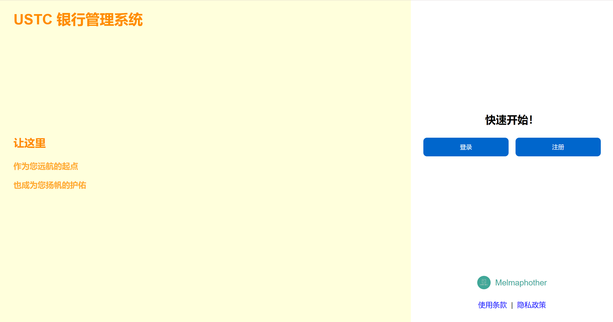
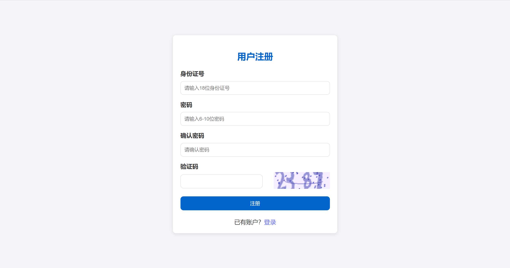
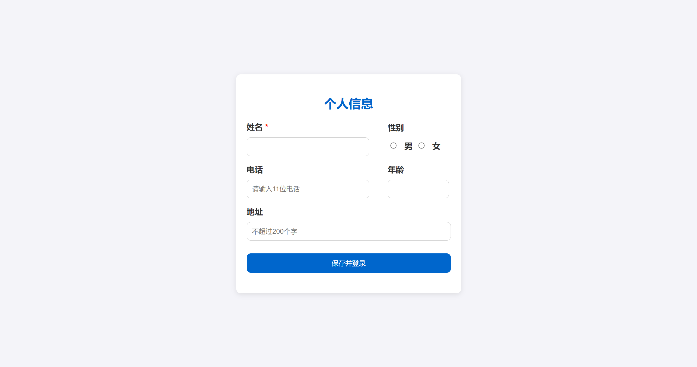
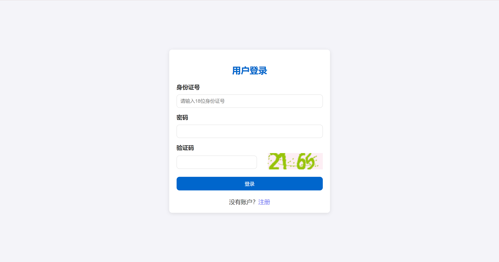
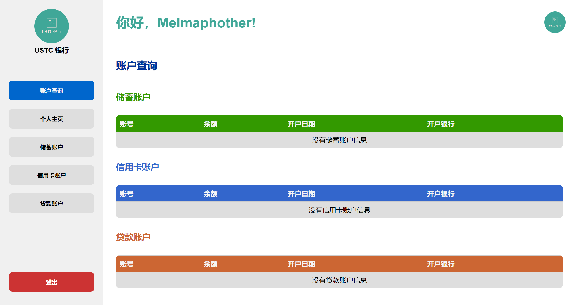
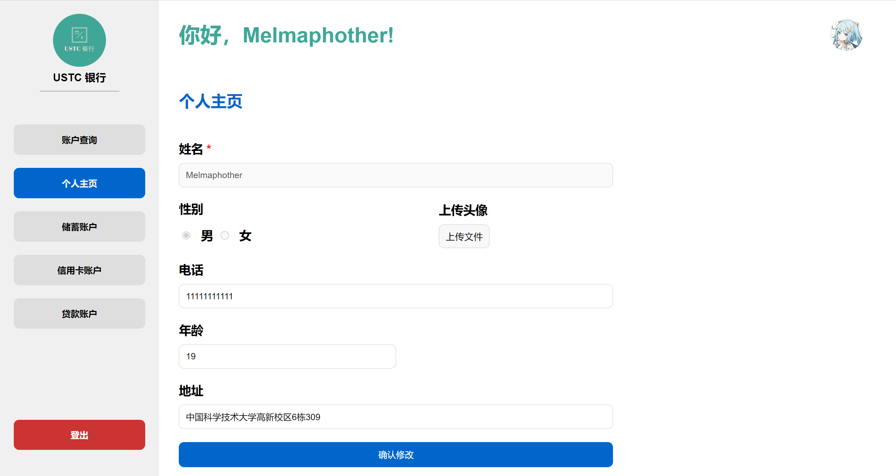
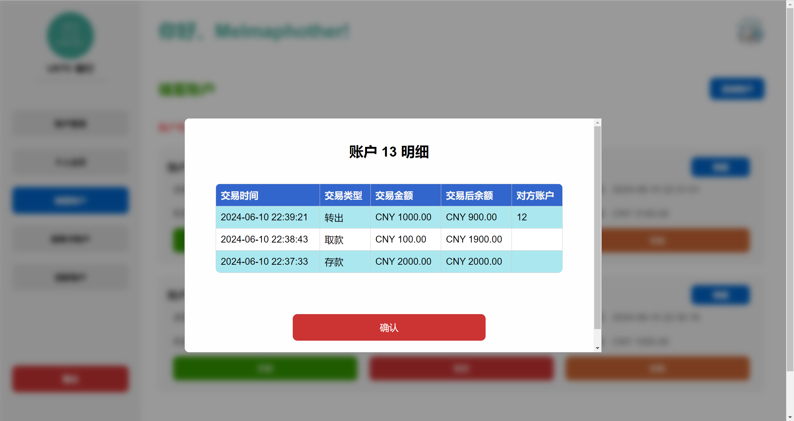
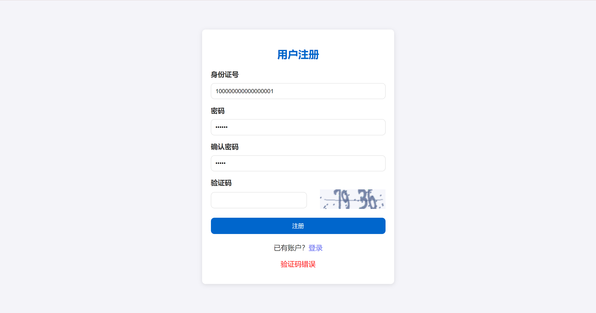

<div style="text-align:center;font-size:2em;font-weight:bold">中国科学技术大学计算机学院</div>

<div style="text-align:center;font-size:2em;font-weight:bold">《数据库系统实验报告》</div>


<div style="display: flex;flex-direction: column;align-items: center;font-size:1.6em">
<div>
<p>实验题目：USTC 银行在线管理平台</p>
<p>学生姓名：王道宇</p>
<p>学生学号：PB21030794</p>
<p>完成时间：2024 年 6 月 8 日</p>
</div>
</div>

<div style="page-break-after:always"></div>

## 需求分析

USTC 银行在线管理平台旨在为中国科学技术大学的学生提供一个便捷、安全的银行服务系统。通过该平台，用户可以进行各种金融操作，如账户管理、资金转账、借款和还款等，同时也能在线处理与个人银行账户相关的各项事务。

### 应用场景描述

1. **注册与登录**：用户可以自行实现注册与登录的各项事宜。注册中，用户通过输入两次密码和验证码保证了合理性，通过用户组策略让用户不会看到除自己之外的用户的数据，保证了数据库的隐私性和安全性。
2. **账户查看与管理**：用户登录系统后，可以查看自己的储蓄账户、信用卡账户和贷款账户的详细信息，如开户行、账户余额等。
3. **个人信息管理**：用户可以更新自己的个人信息，如联系电话、住址等。此外，系统提供了上传和更新个人头像的功能，使得用户界面更加个性化。
4. **账户功能**：
   - **添加账户**：用户可以根据需要添加新的储蓄账户或信用卡账户。系统允许用户根据自己的需求选择账户类型，并填写相关信息来开设新账户。新账户开设时需要设置密码，密码将会**哈希**后存在数据库中，保证用户信息的安全性。
   - **存款和取款**：各种账户均可以存款和取款。并且需要输入设定的账户密码，在借款时不得超出余额以及单次借款额度。
   - **借贷与还贷**：贷款账户用户可以申请借款，系统将根据用户的申请来审批借款申请。还款功能允许用户在到期还款或提前还款，系统会自动计算应还金额。
   - **转账功能**：用户可以在自己的各种账户之间，或向其他用户的账户进行资金转账。转账过程中，系统提供即时的资金转移和状态更新。
   - **查看明细**：用户能够查看每个账户的具体明细，包括交易时间、交易金额和交易类型等信息。
5. **借贷与还贷管理**：用户可以查看和管理自己的贷款状态，包括借贷额度、已还款额和剩余借贷额等。系统提供详细的贷款明细，用户可以随时查询每笔借贷和还贷的记录。

## 总体设计

### 系统模块结构

USTC 银行在线管理平台采用了 Django 作为中间层、MySQL 作为后端数据库，以及 HTML、CSS 和 JavaScript 作为前端技术栈。下面是对前端和后端模块的介绍：

#### 前端模块

1. **用户界面（UI）**：
   - **HTML**：负责结构的定义，HTML 为用户交互提供了基本的页面框架。这包括各种表单、按钮、链接和数据显示区域，如账户信息、个人信息及交易记录等。
   - **CSS**：用于布局 HTML 页面。CSS 可以为不同的元素提供丰富的样式，如颜色、布局、字体和响应式设计。
   - **JavaScript **：增强了页面的交互性。JavaScript 允许实现动态功能，如表单验证、页面动态更新（无需重新加载页面）、以及与后端服务器的异步通信（使用 AJAX）。这些功能一般来说符合用户直觉。
2. **前端逻辑处理**：
   - 前端逻辑主要涉及到用户输入处理、数据格式验证、发送请求到服务器以及处理从服务器返回的数据。

#### 后端模块

1. **Django 应用层**：
   - **视图层（Views）**：处理来自前端的请求，执行相应的业务逻辑，然后返回响应。包括获取数据库数据、处理数据并生成用于前端显示的数据。
   - **模型层（Models）**：定义与数据库交互的数据结构。在 Django 中，每个数据表以一个 Python 类，它定义表的属性、特征，提供了存储和检索数据库信息的机制。通过模型和对应的 orm 机制，可以简化对 MySQL 数据库的操作。
   - **模板层（Templates）**：负责动态生成 HTML。
2. **数据库（MySQL）**：
   - 存储所有用户数据、账户信息、交易记录等。后端通过 Django 模型与数据库进行交互，利用 SQL 进行数据查询和事务处理。

#### 系统工作流程

1. 欢迎界面

   

2. 注册界面

   

3. 注册后填写个人信息

   

4. 登录界面

   

5. 主页

   

6. 个人主页

   

7. 添加账户

   不跳转 url，通过背景模糊 + 弹窗的形式，动态展示添加账户页面，符合用户直觉。

   

8. 账户详情

   

9. 存款

   

10. 取款

    

11. 转账

    

12. 查看明细

    

13. 表单填写错误处理
    刷新验证码，保存未出错的表单信息，避免重复填写，提示错误信息。

    

14. 账户操作提示信息
    以浏览器自带 alert 提示操作成功或失败的信息。

    

#### 数据库设计

> ER 图
>
> 模式分解
>
> 存储过程、触发器、函数等设计思路

1. ER 图

   

2. 数据表外键依赖

   

## 核心代码解析（可改名为对应模块，如后端实现）

#### 仓库地址

github 链接：

[2024-USTC-Database-Lab2](https://github.com/Melmaphother/2024-USTC-Database-Lab2)

#### 目录

```bash
2024-USTC-Database-Lab2
│  LICENSE
│  README.md
│  requirements.txt   ------------------ 项目依赖
│
├─assets  ------------------ README.md 中的图片
│
├─design
│  │
│  ├─backend ------------------ 后端设计，包括数据库建模、API 设计、ER 图
│  │
│  └─frontend  ------------------ 前端设计，包括页面设计
│
├─docs  ------------------ 项目文档，包括需求分析、设计分析、项目日志、实验手册
│  │
│  └─Django Notes  ------------------ Django 笔记
│
└─src
    ├─BankManageSystem  ------------------ Django 项目
    │  │  manage.py  ------------------ Django 项目启动文件
    │  │
    │  ├─BankManageSystem ---------------- Django 项目配置文件，包括路由、数据库配置
    │  │
    │  ├─bank_service ------------- 银行服务，包括主页、注册、登录、账户的视图函数
    │  │  │
    │  │  └─account_utils ------------------  专门用于处理各种账户交易的视图函数
    │  │
    │  ├─statics  ------------------ 静态文件
    │  │  ├─css  ------------------ 欢迎界面、注册、登录的样式
    │  │  │  │
    │  │  │  └─dashboard ------------------ 登入后具体各部分的主页样式
    │  │  │
    │  │  ├─image  ------------------ 项目的 Logo
    │  │  │
    │  │  └─js  ------------------ 主页 js 文件
    │  │      │
    │  │      └─dashboard ------------------ 登入后具体各部分的主页 js 文件
    │  │
    │  └─templates  html ------------------ 文件，包括欢迎界面、注册、登录、主页
    │      │
    │      └─dashboard ------------------  登入后具体各部分的主页
    │
    └─sql_src  ------------------ 数据库存储过程、函数、触发器、初始化数据库
```

#### 标题 1

> 分为若干个标题，以一定逻辑顺序讲解代码，如按 ER 图实体、关系讲解数据库建模代码，按存储过程、触发器分类讲解代码、按前端实现、接口等讲解前端代码
>
> 注意不要无脑粘贴代码，选取具有代表性的代码讲解，并注明文件来源，如首行注释: // backend\models.py

## 实验与测试

#### 依赖

> 所需的库、运行环境

#### 部署

- clone 本项目：

  ```bash
   $ git clone https://github.com/Melmaphother/2024-USTC-Database-Lab2.git
  ```

- 安装 MySQL，创建数据库 `bank_manage_system`：

  ```bash
  $ mysql -u username -p password
  $ create database db_name default charset=UTF8MB4
  ```

- 进入目录 `src/BankManageSystem/BankManageSystem/settings.py`，修改数据库配置：
  
  ```python
  DATABASES = {
      'default': {
          'ENGINE': 'django.db.backends.mysql',
          'NAME': 'bank_manage_system',
          'USER': 'your username',
          'PASSWORD': 'your password',
          'HOST': 'localhost',
          'PORT': '3306',
        }
    }
  ```
- 安装 Anaconda，搭建 Python 环境：
  
  ```bash
  $ conda create -n django python=3.11
  $ conda activate django
  ```
- 安装必要的包：
  
  ```bash
  $ pip install -r requirements.txt
  ```
- 进入目录 `src/BankManageSystem`，创建数据表：

  ```bash
  $ python manage.py migrate
  ```

- 在数据库 IDE（DataGrip、MySQL Workbench）中，运行 `src/sql_src/init_database.sql`：

  这一步是为了避免外键依赖导致业务操作失败。

- 启动本地服务器：

  ```bash
  $ python manage.py runserver [localhost:8000]
  ```

- 在浏览器中输入 `localhost:8000`，即可查看项目：
  
  为了保证使用体验，建议使用 **Chrome 或 Edge 浏览器**，将窗口**缩放为 125%** 体验更佳。

#### 实验结果

1. 触发器

   本项目设计的触发器为：当账户记录有更新时，将该次账户记录所涉及的金额加到该账户的交易总额中。这个过程全称由触发器完成。

2. 存储过程

   添加账户所采用的策略为当前分配的账户号为当前最大账户号加 1，所以添加账户、存款、取款、转账，均由存储过程完成，提前编译以避免每次操作都要重新加载，降低服务器的负载。

   简单的查询由 Django 提供的 orm 来完成。

3. 文件管理

   本实验实现了对用户头像的管理，用户注册时以项目 logo 为初始头像，在个人主页可以自行更改头像、每次更改头像时将替换原有头像，保证数据库的一致性以及简洁性。

## 参考

1. 前端未使用任何模板。前端配色来源于 [ChatGPT](https://chatgpt.com/)。

2. 使用 Django 库，其余依赖包已在项目 README 里详细介绍。
