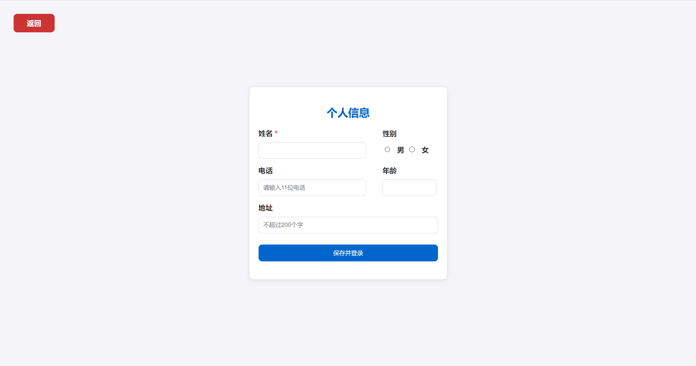
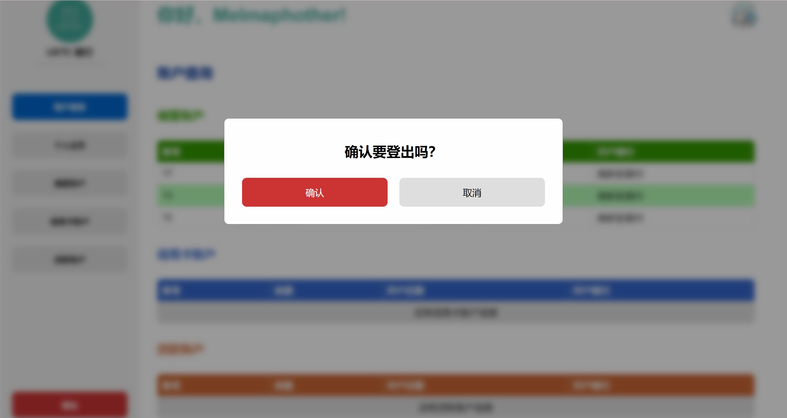

<div style="text-align:center;font-size:2em;font-weight:bold">中国科学技术大学计算机学院</div>

<div style="text-align:center;font-size:2em;font-weight:bold">《数据库系统实验报告》</div>


<div style="display: flex;flex-direction: column;align-items: center;font-size:1.6em">
<div>
<p>实验题目：USTC 银行在线管理平台</p>
<p>学生姓名：王道宇</p>
<p>学生学号：PB21030794</p>
<p>完成时间：2024 年 6 月 21 日</p>
</div>
</div>

<div style="page-break-after:always"></div>

## 需求分析

USTC 银行在线管理平台旨在为中国科学技术大学的学生提供一个便捷、安全的银行服务系统。通过该平台，用户可以进行各种金融操作，如账户管理、资金转账、借款和还款等，同时也能在线处理与个人银行账户相关的各项事务。

### 应用场景描述

1. **注册与登录**：用户可以自行实现注册与登录的各项事宜。注册中，用户通过输入两次密码和验证码保证了合理性，通过用户组策略让用户不会看到除自己之外的用户的数据，保证了数据库的隐私性和安全性。
2. **账户查看与管理**：用户登录系统后，可以查看自己的储蓄账户、信用卡账户和贷款账户的详细信息，如开户行、账户余额等。
3. **个人信息管理**：用户可以更新自己的个人信息，如联系电话、住址等。此外，系统提供了上传和更新个人头像的功能，使得用户界面更加个性化。
4. **账户功能**：
   - **添加账户**：用户可以根据需要添加新的储蓄账户或信用卡账户。系统允许用户根据自己的需求选择账户类型，并填写相关信息来开设新账户。新账户开设时需要设置密码，密码将会**哈希**后存在数据库中，保证用户信息的安全性。
   - **存款和取款**：各种账户均可以存款和取款。并且需要输入设定的账户密码，在借款时不得超出余额以及单次借款额度。
   - **借贷与还贷**：贷款账户用户可以申请借款，系统将根据用户的申请来审批借款申请。还款功能允许用户在到期还款或提前还款，系统会自动计算应还金额。
   - **转账功能**：用户可以在自己的各种账户之间，或向其他用户的账户进行资金转账。转账过程中，系统提供即时的资金转移和状态更新。
   - **查看明细**：用户能够查看每个账户的具体明细，包括交易时间、交易金额和交易类型等信息。
5. **借贷与还贷管理**：用户可以查看和管理自己的贷款状态，包括借贷额度、已还款额和剩余借贷额等。系统提供详细的贷款明细，用户可以随时查询每笔借贷和还贷的记录。

## 总体设计

### 系统模块结构

USTC 银行在线管理平台采用了 Django 作为中间层、MySQL 作为后端数据库，以及 HTML、CSS 和 JavaScript 作为前端技术栈。下面是对前端和后端模块的介绍：

#### 前端模块

1. **用户界面（UI）**：
   - **HTML**：负责结构的定义，HTML 为用户交互提供了基本的页面框架。这包括各种表单、按钮、链接和数据显示区域，如账户信息、个人信息及交易记录等。
   - **CSS**：用于布局 HTML 页面。CSS 可以为不同的元素提供丰富的样式，如颜色、布局、字体和响应式设计。
   - **JavaScript **：增强了页面的交互性。JavaScript 允许实现动态功能，如表单验证、页面动态更新（无需重新加载页面）、以及与后端服务器的异步通信（使用 AJAX）。这些功能一般来说符合用户直觉。
2. **前端逻辑处理**：
   - 前端逻辑主要涉及到用户输入处理、数据格式验证、发送请求到服务器以及处理从服务器返回的数据。

#### 后端模块

1. **Django 应用层**：
   - **视图层（Views）**：处理来自前端的请求，执行相应的业务逻辑，然后返回响应。包括获取数据库数据、处理数据并生成用于前端显示的数据。
   - **模型层（Models）**：定义与数据库交互的数据结构。在 Django 中，每个数据表以一个 Python 类，它定义表的属性、特征，提供了存储和检索数据库信息的机制。通过模型和对应的 orm 机制，可以简化对 MySQL 数据库的操作。
   - **模板层（Templates）**：负责动态生成 HTML。
2. **数据库（MySQL）**：
   - 存储所有用户数据、账户信息、交易记录等。后端通过 Django 模型与数据库进行交互，利用 SQL 进行数据查询和事务处理。

#### 系统工作流程

1. 浏览器输入 localhost:8000 自动跳转到 **欢迎界面**，可以在此选择：

   - 已有账号，**登录**
   - 没有账号，**注册**
   - 查看**使用条款** 或 **隐私政策**

   

2. 以查看**使用条款**为例：

   查看完毕之后可以点击 **确认并返回** 键来回到 home 页面。

   

3. 注册界面

   用户一旦注册便已在数据库中创建了账户。由于我们不强制收集用户其它的个人信息，所以将注册和用户信息的收集分成两个部分，在注册之后虽然在数据库中创建了账户，但也只包含身份证号、密码等必要信息，其余信息不会强制收集。

   >  验证码的作用：防止恶意程序批量注册账户；避免暴力破解密码的攻击；保护网站表单不被滥用。

   

4. 注册后可以选填个人信息

   上述注册页面注册完成之后将会跳转到编辑个人信息的界面。

   除了必要的姓名，本系统不强制收集其他信息，用户的初始头像为本项目的 logo（在之后可以自行设置）。**编辑个人信息之后系统直接为用户登录**：

   

5. 登录界面

   与注册界面类似，用户输入用户名和密码，系统验证后登录：

   

6. 主页

   **只能通过注册或登录进入（若直接访问 url，则会重定向到登录界面）**，主页包括账户信息、个人信息、账户操作等：

   

7. 个人主页

   用户默认头像为项目 logo，可以自行更改头像：

   

8. 添加账户

   **不跳转 url，通过背景模糊 + 弹窗的形式**，动态展示添加账户页面，符合用户直觉。

   

9. 账户详情

   

10. 存款

    输入存款金额和账户密码即可进行存款业务。

    

11. 取款

    取款时，提示当前账户余额和提款额度，提醒用户最多可以取款的量。

    

12. 转账

    这里转账额度也以提款额度代替。

    同时在服务器端保证了不能转账给当前账户号。

    

13. 查看明细

    明细表为 Javascript 动态生成，从后端拉取数据后，渲染出明细表格，当交易金额为转账时，将会标记是转入还是转出，并标记对方账户。同样的，对方账户也会有对应的修改以及对应的明细。

    

14. 表单填写错误处理

    注册登录、填写个人信息时，表单填写若出错或不符合数据要求的，并不会清空所有的已填写内容，而是只刷新验证码，**保存未出错的表单信息，避免重复填写**，同时在下方提示错误信息。

    

15. 账户操作提示信息

    当某项账户操作成功或失败时，使用浏览器自带 `alert` 提示操作成功或失败的信息。

    

16. 登出

    点击下方的登出按钮，跳出弹窗即可登出，登出之后将会跳转到 home 页面，完成闭环。

    

17. 再次回到 home 页面

    

#### 数据库设计

1. ER 图

   

2. 数据表外键依赖

   

## 核心代码解析

### 中间件实现

Django 使用 models.py 定义数据库模型，views.py 定义视图函数，其中数据库模型即为数据库表的映射，视图函数即为对数据库表的操作。这里以 Account 为例，展示数据库模型和视图函数的实现。

1. Account 表的实现

   ```python
   class Account(models.Model):
       a_no = models.IntegerField(primary_key=True)
    	a_type = models.CharField(max_length=20, blank=True, default='')
    	a_currency = models.CharField(max_length=3, blank=True, default='')
    	a_balance = models.DecimalField(max_digits=20, decimal_places=2)
    	a_open_time = models.DateTimeField()
    	a_open_b_name = models.ForeignKey(Bank, on_delete=models.CASCADE,
                                      related_name='accounts', 			db_column='a_open_b_name',
                                      default='')
    	a_password_hash = models.CharField(max_length=128, blank=True, default='')
    	a_total = models.DecimalField(max_digits=20, decimal_places=2, default=0)
   
    	class Meta:
        	db_table = 'account'
   ```

   这里使用一个类来定义 Account 表，其中包括了账户号、账户类型、账户余额、开户时间、开户行、密码哈希和交易总额等字段。其中有一些细节：

   - 字符串字段总是使用 `blank=True, default=''` 来避免空字符串的问题。因为 SQL 数据库中空字符串通常使用 '' 表示，而空值使用 NULL 表示，为了避免分辨空值还是空字符串，这里使用默认值 '' 来表示空字符串。
   - 同样的，对于非字符串但允许为空的字段，比如年龄等整数字段，可以使用 `null=True` 来表示空值。
   - a_open_b_name 为外键，关联到 Bank 表的 b_name 字段，这里使用 `on_delete=models.CASCADE` 表示级联删除，即当 Bank 表中的某个记录被删除时，Account 表中关联到该记录的所有记录也会被删除。
   - 这里使用 `class Meta`，自定义了表名，在这里同样也可以定义 `Unique` 的字段。

2. 存款视图函数

    ```python
    @login_required
    def savings_account_deposit(request):
    	if request.method == 'GET':
        	return redirect('savings')
    	elif request.method == 'POST':
        	a_no = request.POST.get('a_no')
        	amount = request.POST.get('amount')
        	password = request.POST.get('password')
    
        	# 检查 amount 是否为数字
    
        	# 检查密码是否正确
    
        	try:
            	with connection.cursor() as cursor:
                	cursor.callproc('savings_account_deposit', [a_no, amount])
            	# 获取当前的余额
            	account = Account.objects.get(a_no=a_no)
            	messages.success(request, f'账户号：{a_no}，存款成功，当前余额：{account.a_currency} {account.a_balance}')
        	except:
                messages.error(request, f'账户号：{a_no}，存款失败')
    
        	return redirect('savings')
    ```

    为了简洁起见，省略了检查 amount 是否为数字和密码是否正确的代码。

    - 这里首先定义了一个存款视图函数，用户在页面上输入账户号、存款金额和密码后，点击提交按钮，会发送 POST 请求到这个视图函数。
    - 这个函数首先获取用户输入的账户号、存款金额和密码，然后检查存款金额是否为数字，密码是否正确。
    - 最后使用 Django 的数据库连接对象 connection 来调用存储过程 savings_account_deposit，该存储过程会在数据库中执行存款操作。最后，获取存款后的余额，返回给用户，用于提示当前的余额。

### 后端实现

1. 触发器

   本项目设计的触发器为：当账户记录有更新时，将该次账户记录所涉及的金额加到该账户的交易总额中。这个过程全称由触发器完成。

   ```sql
   drop trigger if exists update_account_total;
   CREATE TRIGGER update_account_total
       AFTER INSERT
       ON savings_account_record
       FOR EACH ROW
   BEGIN
       -- 更新账户表中的交易总额字段
       UPDATE account
       SET a_total = a_total + NEW.sar_amount
       WHERE a_no = NEW.sar_a_no;
   END
   ```

2. 存储过程

   添加账户所采用的策略为当前分配的账户号为当前最大账户号加 1，所以添加账户、存款、取款、转账，均由存储过程完成，提前编译以避免每次操作都要重新加载，降低服务器的负载。

   这里以添加账户的存储过程示例：

   ```sql
   drop procedure if exists savings_account_add;
   create procedure savings_account_add(
       IN c_id varchar(18),
       IN b_name varchar(50),
       IN rate decimal(5, 4),
       IN currency varchar(3),
       IN withdraw_limit decimal(20, 2),
       IN a_password varchar(128)
   )
   begin
       declare new_a_no INT;
       begin
   		GET DIAGNOSTICS CONDITION 1
   		@p1 = RETURNED_SQLSTATE, @p2 = MESSAGE_TEXT;
   		SELECT @p1 AS RETURNED_SQLSTATE , @p2 AS MESSAGE_TEXT;
   		rollback ;
   	end;
       start transaction; -- 开启事务
   
       -- 检查是否存在账户，不存在则从1开始，存在则找当前最大值+1
       select coalesce(max(a_no) + 1, 1)
       into new_a_no
       from account;
   
       -- 打印新的账户号
       select new_a_no as new_a_no;
   
       -- 在 account 表中插入新的账户
       insert into account(a_no, a_type, a_currency, a_balance, a_open_time, a_open_b_name, a_password_hash, a_total)
       value (new_a_no, 'Savings', currency, 0, now(), b_name, a_password, 0);
   
   
       -- 插入 savings_account 的特殊信息
       insert into savings_account(sa_no, sa_rate, sa_withdraw_limit)
       value (new_a_no, rate, withdraw_limit);
   
       -- 插入 account_hold_manage 表
       insert into account_hold_manage(ahm_a_no, ahm_c_id)
       value (new_a_no, c_id);
   
       commit; -- 提交事务
   end;
   
   -- 调用存储过程
   call savings_account_add('100000000000000006', '东区银行', 0.01, 'CNY', 1000);
   ```

   简单的查询由 Django 提供的 orm 来完成。

3. 文件管理

   本实验实现了对用户头像的管理，用户注册时以项目 logo 为初始头像，在个人主页可以自行更改头像、每次更改头像时将替换原有头像，保证数据库的一致性以及简洁性。

### 前端实现

前端以 HTML 为核心、CSS 控制样式、Javascript 控制动态生成。这里以**动态生成的账户明细**为例子，展示这三者的交叉：

1. HTML 骨架，用于排版内容

   ```html
   <div id="detailModal" class="modal">
       <div class="business-modal-content detail-modal-content">
           <h2 class="detail">账户 <span id="hiddenDetailAccountNumber"></span> 明细</h2>
           <div class="detail-table">
               <table>
                   <thead>
                   <tr>
                       <th>交易时间</th>
                       <th>交易类型</th>
                       <th>交易金额</th>
                       <th>交易后余额</th>
                       <th>对方账户</th>
                   </tr>
                   </thead>
                   <tbody>
                   <!-- 动态内容将会插入这里 -->
                   </tbody>
               </table>
           </div>
           <div class="detail-button-container">
               <button onclick="closeDetailModal()" class="confirm">确认</button>
           </div>
       </div>
   </div>
   ```

   可以看到，这里定义了分割，并使用类选择器与 CSS 对应，同时定义表头、按钮等必要组件，用于显示内容和退出。 

2. CSS 样式，使表格具有圆角、加粗表头、交替的颜色等样式

   ```css
   .detail-table {
       display: flex;
       align-items: center;
       justify-content: center;
       width: 100%; /* 确保有足够的宽度 */
   }
   
   .detail-table table {
       width: 90%;
       border-collapse: collapse;
       margin: 20px auto;
       border-radius: 8px;
       overflow: hidden;  /* 确保所有内容都被包含在圆角内 */
   }
   
   .detail-table th, td {
       border: 1px solid #ccc;
       padding: 8px;
       text-align: left;
       background-color: white;
   }
   
   .detail-table th {
       background-color: #3366CC;
       color: whitesmoke;
   }
   
   .detail-table tr:nth-child(odd) td {
       background-color: #abe7ef;
   }
   
   .detail-table td.empty-row {
       background-color: #dedede;
       text-align: center;
   }
   ```

   这里使用 `flex` 布局，让表格部分水平竖直居中，使用 `overflow: hidden` 表示当表格内容不够长时不加入侧边滑动条、当表格较长时使用滑动条滑动浏览。

   同时这里使用 `tr:nth-child(odd) td` 实现了交替的颜色，使表格样式更加丰富。

3. Javascript 动态生成表格内容。明细是随着每一次该账户的业务而变化的。

   - 打开查看明细的按钮时，使用异步操作请求该账户的记录（在数据库中就是一个账户记录表）：

     ```js
     function openDetailModal(button) {
         let account_number = button.getAttribute('data-detail-account-number')
         document.getElementById('hiddenDetailAccountNumber').textContent = account_number;
         document.getElementById('detailModal').style.display = 'block';
         document.getElementById('pageContent').style.filter = 'blur(5px)';
     
         let csrfToken = document.getElementById('csrfToken').value;
     
         // AJAX 请求获取交易明细
         fetch(`/savings_account_details/?account_number=${account_number}`, {
             method: 'GET',
             headers: {
                 'Content-Type': 'application/json',
                 'X-CSRFToken': csrfToken
             }
         })
             .then(response => response.json())
             .then(data => {
                 updateDetailTable(data.details);
             })
             .catch(error =>
                 console.error('Error fetching account details:', error)
             );
     }
     ```

     获得交易明细之后，将数据发送到 `updateDetailTable` 函数，用于动态生成 html 代码：

     ```js
     function updateDetailTable(details) {
         let tableBody = document.querySelector('.detail-table table tbody');
         tableBody.innerHTML = '';  // 清空表格内容
         if (details.length > 0) {
             details.forEach(detail => {
                 let row = `<tr>
                     <td>${detail.d_time}</td>
                     <td>${detail.d_type}</td>
                     <td>${detail.d_amount}</td>
                     <td>${detail.d_balance}</td>
                     <td>${detail.d_other_a_no}</td>
                 </tr>`;
                 tableBody.innerHTML += row;
             });
         } else {
             tableBody.innerHTML = '<tr><td colspan="5" class="empty-row">没有交易信息</td></tr>';
         }
     }
     ```

     这样就动态实现了表格的生成，同时不影响主进程。

4. 最终效果如下：

   

#### 仓库地址

> github 链接：
>
> [2024-USTC-Database-Lab2](https://github.com/Melmaphother/2024-USTC-Database-Lab2)

#### 目录

```bash
2024-USTC-Database-Lab2
│  LICENSE
│  README.md
│  requirements.txt   ------------------ 项目依赖
│
├─assets  ------------------ README.md 中的图片
│
├─design
│  │
│  ├─backend ------------------ 后端设计，包括数据库建模、API 设计、ER 图
│  │
│  └─frontend  ------------------ 前端设计，包括页面设计
│
├─docs  ------------------ 项目文档，包括需求分析、设计分析、项目日志、实验手册
│  │
│  └─Django Notes  ------------------ Django 笔记
│
└─src
    ├─BankManageSystem  ------------------ Django 项目
    │  │  manage.py  ------------------ Django 项目启动文件
    │  │
    │  ├─BankManageSystem ---------------- Django 项目配置文件，包括路由、数据库配置
    │  │
    │  ├─bank_service ------------- 银行服务，包括主页、注册、登录、账户的视图函数
    │  │  │
    │  │  └─account_utils ------------------  专门用于处理各种账户交易的视图函数
    │  │
    │  ├─statics  ------------------ 静态文件
    │  │  ├─css  ------------------ 欢迎界面、注册、登录的样式
    │  │  │  │
    │  │  │  └─dashboard ------------------ 登入后具体各部分的主页样式
    │  │  │
    │  │  ├─image  ------------------ 项目的 Logo
    │  │  │
    │  │  └─js  ------------------ 主页 js 文件
    │  │      │
    │  │      └─dashboard ------------------ 登入后具体各部分的主页 js 文件
    │  │
    │  └─templates  html ------------------ 文件，包括欢迎界面、注册、登录、主页
    │      │
    │      └─dashboard ------------------  登入后具体各部分的主页
    │
    └─sql_src  ------------------ 数据库存储过程、函数、触发器、初始化数据库
```

## 实验与测试

#### 依赖

> 已经在项目的 `requirements.txt` 中，按照下方的部署即可

#### 部署

- clone 本项目：

  ```bash
   $ git clone https://github.com/Melmaphother/2024-USTC-Database-Lab2.git
  ```

- 安装 MySQL，创建数据库 `bank_manage_system`：

  ```bash
  $ mysql -u username -p password
  $ create database db_name default charset=UTF8MB4
  ```

- 进入目录 `src/BankManageSystem/BankManageSystem/settings.py`，修改数据库配置：

  ```python
  DATABASES = {
      'default': {
          'ENGINE': 'django.db.backends.mysql',
          'NAME': 'bank_manage_system',
          'USER': 'your username',
          'PASSWORD': 'your password',
          'HOST': 'localhost',
          'PORT': '3306',
        }
    }
  ```

- 安装 Anaconda，搭建 Python 环境：

  ```bash
  $ conda create -n django python=3.11
  $ conda activate django
  ```

- 安装必要的包：

  ```bash
  $ pip install -r requirements.txt
  ```

- 进入目录 `src/BankManageSystem`，创建数据表：

  ```bash
  $ python manage.py migrate
  ```

- 在数据库 IDE（DataGrip、MySQL Workbench）中，运行 `src/sqls/init_database.sql`：

  这一步是为了避免外键依赖导致业务操作失败。

- 启动本地服务器：

  ```bash
  $ python manage.py runserver [localhost:8000]
  ```

- 在浏览器中输入 `localhost:8000`，即可查看项目：

  为了保证使用体验，建议使用 **Chrome 或 Edge 浏览器**，将窗口**缩放为 125%** 体验更佳。

## 参考

1. 前端**未使用任何模板**。前端配色的设计灵感来源于 [ChatGPT](https://chatgpt.com/)。

2. 使用 Django 库，其余依赖包已在项目 README 里详细介绍。
